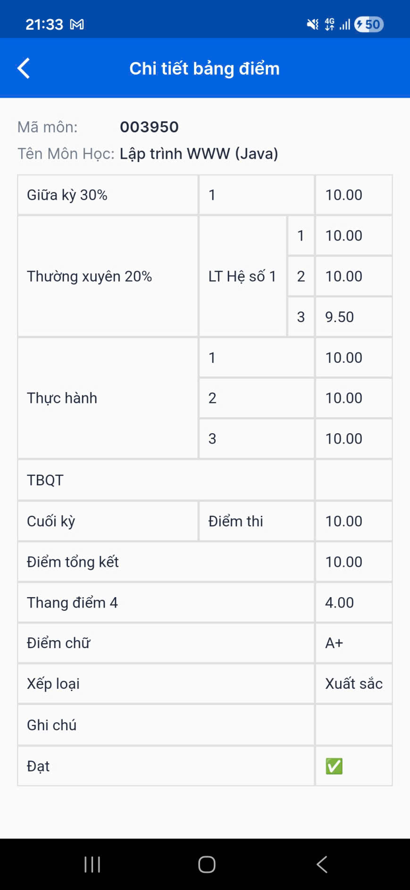

# React Native Lab IUH
Đây là các project học thực hành lập trình cho thiết bị di động ở trường hằng tuần.

## Nội dung
- Midterm: ôn thi giữa kỳ
- Week 10: ôn kiểm tra Spring Security

## Góc khoe

## Youtube
- YouTube: https://www.youtube.com/@HuynhDucPhu2502
- Playlist “Lập trình WWW”: https://youtube.com/playlist?list=PLImLByxRNRWOu9kTyXdCCX9nUnsNjZQvw&si=8G9R9jMcoLHZj2EV
